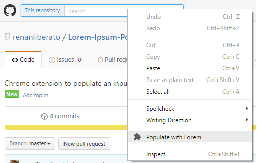

# Lorem-Ipsum-Populator
Chrome extension to populate an input with lorem ipsum content

To install the extension, follow the instructions as described [here](https://developer.chrome.com/extensions/getstarted#unpacked) (the usage guide will be updated later).

